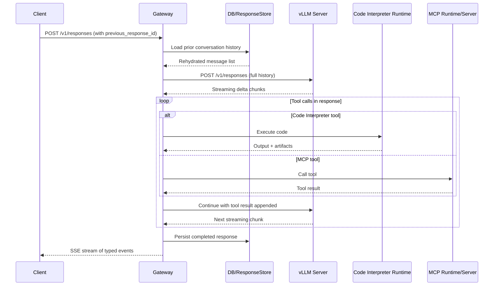

# ADR-01 — Project Core
> **Status:** Draft — open for community review
> **Language:** Python (Red Hat, DaoCloud, EmbeddedLLM voted Python; Meta leaned Rust but deferred)
> **Deciders:** Francisco Arceo, Sébastien Han, Ben Browning, Andrew Xia, Tun Jian Tan, Jia Huei Tan, Cheong Ye Hur, Maral Bahari

---

## 1. Overview

This ADR covers the foundational architecture of **agentic-stack** — an open-source gateway that sits in front of a stateless LLM inference backend and turns it into a stateful, tool-capable Responses API endpoint.

Three core challenges:

1. **Statefulness.** Clients shouldn't have to send their full conversation history every request. The Responses API lets the client reference a prior response via `previous_response_id` and send only new input. The gateway needs to bridge that gap.
2. **Protocol translation.** The upstream gives us stateless delta chunks. Clients expect typed, sequenced SSE with stable item IDs and proper lifecycle events for each output type.
3. **Tool execution.** Built-in tools (code interpreter, file search, web search) and MCP tools need to run mid-request in the gateway, transparent to the client.

We're proposing a six-layer package structure, a response store, and a three-stage event pipeline. These are all proposals — feedback welcome before we lock anything in.

### 1.1 Decisions from community discussion

These came out of the kickoff meeting and the Slack threads that followed.

**Upstream interface — use vLLM's existing Responses API**

Three options were evaluated for the upstream interface: Chat Completions, `llm.generate()`, and vLLM's existing stateless Responses API. The group landed on vLLM's stateless Responses API (`/v1/responses`) endpoint.

Chat Completions was ruled out early — inside vLLM, the Responses API already routes to `generate()` directly; it doesn't go through Chat Completions. Adding that indirection provides no benefit.

`llm.generate()` was on the table too but ran into pushback in later discussion. The main issue: it would force the gateway to own tokenization and chat template application, which fragments the ecosystem. Additionally, `token-in-token-out` is still WIP while the stateless Responses API is more mature.

Current consensus: plug into the existing Responses API in vLLM, not Chat Completions. The longer term goal is to eventually migrate that implementation into this project. This lines up with the diagram in section 3 showing `POST /v1/responses` to the upstream.

**Tokenization stays in vLLM core**

There was strong agreement against duplicating tokenization logic — it should live in one place. The llm-d project tried building their own tokenization, found it painful, and is converging back to reusing vLLM's logic. The gateway should not rewrite chat template application or tokenization; it delegates all of that to the upstream vLLM server.

**Language: Python**

This was put to a vote. Red Hat, DaoCloud, and EmbeddedLLM all voted Python. Meta advocated for Rust (type safety, performance) but was willing to defer. The practical argument for Python: it's needed to reuse vLLM's preprocessing logic — there's custom per-model code for input sanitization and chat templates that would need a full rewrite in another language. Rust could be explored later for perf-critical paths. Everyone agreed on one language, not multiple.

### 1.2 GPT-OSS / Harmony and multi-model support

GPT-OSS is a top priority for vLLM and a top concern for Red Hat. However, GPT-OSS is Harmony-specific and may not generalize because it does not use the Jinja formats that other models rely on. The agreed direction: separate Harmony parsing from the API layer so the gateway stays generic, and allow Jinja template usage for everything else. Two relevant upstream vLLM efforts are the Parser (issue [#32713](https://github.com/vllm-project/vllm/issues/32713)) and the Renderer (PR [#30200](https://github.com/vllm-project/vllm/pull/30200)).

The proposed validation strategy is to start with two models (GPT-OSS and Kimi) to confirm the architecture works for both Harmony and non-Harmony. A known constraint: vLLM's Responses API is also lossy, and core doesn't want to make it "gigantic" with all Harmony-exclusive fields — so the gateway might need its own way of passing model-specific data.

No consensus yet on how Harmony fields should flow through the system. See open questions.

---

## 2. Goals and Non-Goals

**Goals:**

- Give contributors a clear conceptual map so they can orient quickly
- Keep each layer's responsibilities narrow and independently testable
- Acyclic dependency graph between layers
- Easy to swap subsystems (store backend, HTTP framework, tool runtimes) without touching unrelated code
- Support GPT-OSS (Harmony) as a priority alongside other models
- Don't duplicate tokenization or chat template logic — that's vLLM core's job

**Non-Goals (for this ADR):**

- Concrete class names, file paths, or framework choices — those belong in implementation PRs
- Plugin architecture — maybe later, out of scope for MVP
- Owning tokenization or chat template application (see section 1.1)

---

## 3. System Overview

The gateway sits between clients and an upstream LLM server, adding statefulness, tool execution, and Responses API compliance on top of whatever inference backend the operator points it at.

Some notes:

- "Gateway" here means the HTTP routing + core orchestration layers working together.
- The tool call loop can iterate multiple times if the model makes sequential tool calls.
- SSE stream to the client is interleaved with the tool loop — events go out in real time, not buffered until done.
- "vLLM Server" represents any Responses API-compatible upstream, doesn't have to literally be vLLM. That said, current consensus points at vLLM's existing Responses API endpoint specifically, with the eventual goal of migrating that logic into this project.
- A proposal exists for defining an internal protocol between vLLM and agentic-stack (similar to how vLLM does the KVConnectors API). This would let the gateway access vLLM's Renderer and output parser without reimplementing them. Hasn't been discussed broadly yet — captured as an open question.

---

## 4. Proposed Package Layers

Six conceptual layers. Names are working titles, happy to hear better ones.

| # | Layer | Responsibility |
|---|-------|---------------|
| 1 | **Entry Points** | Process startup, signal handling, ASGI server integration. Should be thin wrappers that assemble the app and hand off to HTTP. |
| 2 | **HTTP Routing** | Routes, request parsing/validation, response serialization. Produces structured objects for the orchestration layer. Owns the SSE streaming loop. |
| 3 | **Core Orchestration** | The main request lifecycle — history rehydration, upstream LLM calls, protocol translation, tool dispatch, response persistence. Most of the complex logic lives here. |
| 4 | **Tool Runtimes** | Built-in tool implementations (code interpreter, file search, web search). Self-contained with a clear interface: start, health-check, execute, shut down. |
| 5 | **MCP Integration** | MCP server management (hosted + request-remote), tool name mapping, security enforcement. MCP is positioned as the primary tool integration interface — the Connectors API is effectively an OpenAI-maintained MCP wrapper, so MCP is the more general and vendor-neutral standard. |
| 6 | **Config & Shared Foundations** | Configuration, DB connections, observability, shared utilities. Should not depend on layers 1-5. |

**MVP scope.** Community discussion converged on a truly minimal starting point. The MVP includes:

- Single FastAPI endpoint: `POST /v1/responses`
- SQLite persistence with history rehydration via `previous_response_id`
- httpx client forwarding requests to the upstream vLLM server
- SSE stream normalization

The MVP **explicitly excludes**: file search, vector search, MCP integration, web search, code interpreter, plugins, and registry patterns. These come in later phases once the core loop is solid.

**Installation model.** The package should be installable as an optional vLLM extra: `uv pip install vllm[responses]`. This keeps the boundary clean — vLLM stays focused on inference, and the gateway is opt-in.

**On the response store.** Two approaches are under discussion:

1. *Single-table with flattened JSON* — each row holds the full conversation history as a JSON blob. Rehydrating a conversation for `previous_response_id` is always one DB read, no chain walking. Simple, but conversation compaction becomes a concern as histories grow.
2. *Normalized multi-table* — separate tables for Responses, Prompts, and Conversations. Avoids compaction issues and enables more flexible querying, but adds schema complexity.

SQLite as the default backend (zero-config), PostgreSQL when you need multi-worker. Database provider classes should be generic to allow swapping backends. Detailed database design discussion is tracked in [issue #14](https://github.com/vllm-project/agentic-stack/issues/14).

---

## Proposed Decisions

These reflect where things stand. Still open for discussion while we're in Draft.

| # | Decision | Status |
|---|----------|--------|
| D1 | Upstream: target vLLM's existing Responses API (`/v1/responses`) | Proposed |
| D2 | Tokenization and chat templates stay in vLLM core | Proposed |
| D3 | Language: Python | Decided |
| D4 | MVP: single endpoint, SQLite, httpx, SSE normalization only | Proposed |
| D5 | Harmony parsing separated from the generic API layer | Proposed |
| D6 | Package installable as optional vLLM extra (`vllm[responses]`) | Proposed |
| D7 | MCP as the primary tool integration interface | Proposed |

---

## Review Discussion Status

This section captures the current state of PR review feedback to keep the discussion legible.

- **MVP scope.** Converging toward a minimal proposal: single `POST /v1/responses` endpoint + SQLite persistence + httpx forwarding + SSE normalization. No tools, no plugins, no MCP in the first cut.
- **Database design.** Two proposals on the table — single-table flattened JSON vs. normalized multi-table. Detailed discussion moved to [issue #14](https://github.com/vllm-project/agentic-stack/issues/14).
- **Tool integration.** Reviewers favor MCP as the primary interface over OpenAI's Connectors API pattern. MCP is the more general standard; Connectors are effectively an OpenAI-maintained wrapper around it.
- **ADR style.** Feedback to remove personal attributions and focus on decisions and rationale rather than who said what. Addressed in this revision.
- **Installation model.** Proposal to distribute as an optional vLLM extra (`vllm[responses]`) received positive reception.
- **Pending reviews.** Still awaiting input from some code owners.

---

## Consequences

If these hold:

- Gateway is a thin stateful layer. The heavy stuff (tokenization, model support) stays in vLLM.
- Adding support for a new model shouldn't require changes here unless it needs special Responses API handling.
- Tests can run without GPUs — the gateway doesn't touch tokenization. This is a frontend component; model requests and output should be replayed instead.
- MVP is achievable with a small team, focused on statefulness and protocol translation.
- Harmony/GPT-OSS support depends on upstream vLLM work on the Renderer ([#30200](https://github.com/vllm-project/vllm/pull/30200)) and Parser ([#32713](https://github.com/vllm-project/vllm/issues/32713)).

---

## Open Questions

These are explicitly left open for discussion.

**On project structure:**

1. **Layer naming.** Better names than "Core Orchestration" and "Config & Shared Foundations" welcome.
2. **Plugin architecture.** Should tool runtimes be loadable as plugins? Enables community extensions without forking but adds complexity. Would love input here.
3. **Dependency enforcement.** What tooling (if any) should enforce the layer dependency rules in CI?

**On upstream interface and model support:**

4. **Internal protocol.** A vLLM Agentic Protocol has been proposed for structured communication between vLLM and this project (like KVConnectors). Worth pursuing? What would it look like? This could change whether we talk to the public Responses API or something lower-level.
5. **Harmony field handling.** vLLM core doesn't want the Responses API bloated with Harmony-exclusive fields. How should that data flow through the gateway? Internal protocol? Sidecar? Something else?
6. **Eventual migration into vLLM core.** A few people mentioned this project could eventually merge back into core as an optional dep. Under what conditions? Should we design for that now?
7. **Relationship to llm-d.** llm-d has overlapping needs around tokenization reuse. Should we coordinate explicitly?

**From PR review discussion:**

8. **Batch API.** How should the gateway handle batch API requests given that vLLM does not provide a native batch endpoint? The proposed approach is to implement batch functionality within this repository by dispatching multiple individual requests (e.g., `/v1/chat/completions`, `/v1/responses`, or embedding/rerank endpoints) to the vLLM server.
9. **Skills / agent capabilities.** Should the gateway expose a skills endpoint for agent capabilities that don't require LLM inference? Could follow a "local shell mode" pattern similar to OpenAI local shell mode https://developers.openai.com/api/docs/guides/tools-skills#use-skills-with-local-shell-mode .
10. **CLI integration surface.** Should the Entry Points layer own a CLI integration like `vllm serve --agentic-stack <model>`?
11. **Connectors API pattern.** Should the internal vLLM protocol (if pursued) follow OpenAI's Connectors API pattern, or is MCP sufficient as the standard?
- Proposed approach is to set MCP as the primary interface following the OpenAI standard of handling remote MCP and connectors https://developers.openai.com/api/docs/guides/tools-connectors-mcp . Connectors are just OpenAI-maintained MCP wrappers (as written in their docs).
