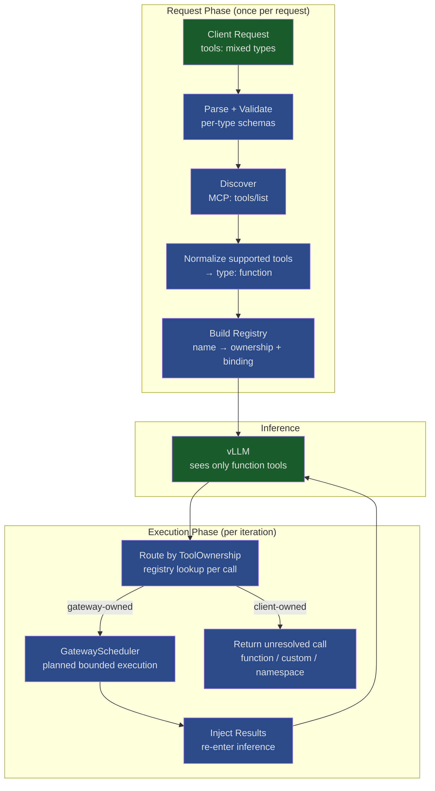
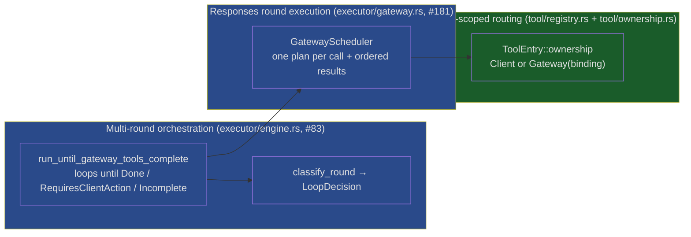

# Design: Tool Framework

> Status: Accepted — implemented and shipping.
> References: [ADR-01 D7](../adr/ADR-01_core.md), [ADR-03 D3](../adr/ADR-03_gateway_integration.md)

> **As-built note.** This document began as a proposal and now reflects what
> shipped. The framework landed across several PRs and diverged from the
> original sketch in a few deliberate ways — most notably the `ToolHandler`
> trait split, explicit ownership plus round execution, a trimmed `LoopDecision`,
> and a new `CodexNamespace` tool type. Those changes are called out inline and mapped to
> their PRs in [Implementation Status](#implementation-status). Sections that
> capture rationale (Principles, Alternatives Considered, Design Decisions) are
> preserved as-designed; the type/trait definitions below match the shipped code.

---

## Problem

Clients send heterogeneous tool types (`function`, `custom`, `namespace`, `mcp`, `web_search`, `file_search`, `code_interpreter`). vLLM only speaks function calling — it produces `function_call` output items regardless of tool origin. The gateway must bridge both directions: normalize supported inbound tools for inference, and route outbound calls to their correct owners.

The original implementation used `ResponsesTool = FunctionTool`. The shipped type-aware framework handles the lifecycle through one pipeline while retaining public tool identity outside the model-facing representation.

---

## Principles

1. **One pipeline, many types.** The tool lifecycle is the same for all types. What varies is the behavior at each stage.
2. **vLLM is function-only.** Model-visible declarations normalize to `type: "function"` before inference. Types without a model-facing implementation are omitted; public tool identity is restored after inference.
3. **Routing by registry, not heuristics.** After inference, `function_call` items are looked up in a request-scoped registry that maps names back to origin type and config.
4. **Ownership decides execution.** Each registry entry has explicit `ToolOwnership`; `ToolType::is_gateway_owned()` supplies the declaration-level default. Client-owned types (`function`, `custom`, `codex namespace`) are never gateway-executed — their calls are returned for the client to resolve. Gateway-owned types (`web_search`, `mcp`, `file_search`, `code_interpreter`) are handled by the gateway. Web search and MCP ship executable bindings; a gateway-owned entry without an implementation produces an error tool result for the next inference round rather than silently dropping the call.
5. **Additive.** New tool types implement a trait and register. The executor loop doesn't change.

---

## Architecture



---

## Pipeline Stages

Every request with tools passes through 7 stages. Stages 1–4 run once at request start. Stages 5–7 repeat per inference iteration.

| # | Stage | Generic (framework) | Type-Specific (handler) |
|---|-------|---------------------|-------------------------|
| 1 | **Parse** | Deserialize `tools[]`, classify by `type` | Validate required fields per type |
| 2 | **Discover** | Iterate handlers, collect discovered tools | MCP: `tools/list`. Others: no-op |
| 3 | **Normalize** | Convert supported model-visible declarations into `Vec<FunctionTool>` for vLLM | MCP: schema → parameters. Web search: synthetic definition. Unsupported types: omit |
| 4 | **Register** | Build `HashMap<name, ToolEntry>` | Store explicit ownership and an optional `GatewayBinding` |
| 5 | **Route** | Lookup `function_call.name` in registry | Determine: gateway-execute or client-passthrough |
| 6 | **Execute** | Bounded concurrency, per-call timeout, same-tool safety, error isolation | MCP: JSON-RPC. WebSearch: HTTP API. Client-owned: skip |
| 7 | **Emit** | Project internal calls into type-specific output items and SSE lifecycles | MCP and web search use gateway-generated events; client tools retain their public call shape |

Stages 1–4 produce two artifacts:
- **Normalized tools** — `Vec<FunctionTool>` forwarded to vLLM
- **Tool registry** — `ToolRegistry` consumed by dispatch for routing

---

## Core Types

### Tool Classification

```rust
#[derive(Debug, Clone, Copy, PartialEq, Eq, Hash)]
pub enum ToolType {
    Function,
    Custom,
    CodexNamespace,   // added by codex integration (#84): a namespaced group of
                      // client-owned function tools (e.g. `mcp__shell.run`).
    Mcp,
    WebSearch,        // internal routing discriminant; serializes as "web_search"
                      // while the wire tag is "web_search_preview".
    FileSearch,
    CodeInterpreter,
}

impl ToolType {
    /// Gateway-owned types are handled server-side; everything else
    /// (`Function`, `Custom`, `CodexNamespace`) is client-owned and handed back.
    pub const fn is_gateway_owned(self) -> bool { /* ... */ }
}
```

> **Drift from proposal:** `CodexNamespace` did not exist in the original
> sketch. Codex declares tools grouped under a namespace whose members are
> client-owned; they flatten to model-visible names for inference and restore
> to `{namespace, name}` on the way out. `is_gateway_owned()` initializes entry
> ownership; routing uses the explicit `ToolOwnership` stored on that entry.

### Request-Side Tool Param

Replaces `pub type ResponsesTool = FunctionTool`:

```rust
#[non_exhaustive]
#[derive(Debug, Clone, Serialize, Deserialize)]
#[serde(tag = "type")]
pub enum ResponsesTool {
    #[serde(rename = "function")]
    Function(FunctionToolParam),

    #[serde(rename = "mcp")]
    Mcp(McpToolParam),

    #[serde(
        rename = "web_search_preview",
        alias = "web_search",
        alias = "web_search_preview_2025_03_11",
        alias = "web_search_2025_08_26"
    )]
    WebSearch(WebSearchToolParam),

    #[serde(rename = "file_search")]
    FileSearch(FileSearchToolParam),

    #[serde(rename = "code_interpreter")]
    CodeInterpreter(CodeInterpreterToolParam),

    // Codex namespace group of client-owned function tools (#84).
    #[serde(rename = "namespace")]
    Namespace(CodexNamespaceToolParam),

    // Client-owned freeform tool; normalized internally and restored on output.
    #[serde(rename = "custom")]
    Custom(CustomToolParam),

    // Forward-compat catch-all: the typed path recognizes and skips unknown
    // declarations rather than attempting to execute them.
    #[serde(rename = "unknown", other)]
    Unknown,
}
```

`#[serde(tag = "type")]` makes this wire-compatible with existing
`{"type":"function",...}` requests. `#[non_exhaustive]` + the `Unknown` catch-all
means an unrecognized tool type does not fail typed deserialization and is never
executed. Eligible raw-proxy requests remain byte-transparent; the typed path omits
unknown declarations. The `web_search` aliases accept the dated OpenAI variants.

### Tool Registry

```rust
pub struct ToolEntry {
    pub tool_type: ToolType,
    pub server_label: Option<String>,  // MCP: which server this tool belongs to
    pub ownership: ToolOwnership,
}

pub struct ToolRegistry {
    entries: HashMap<String, ToolEntry>,
    mcp_list_tools_items: HashMap<String, Vec<McpListTools>>,
}

impl ToolRegistry {
    pub fn lookup(&self, tool_name: &str) -> Option<&ToolEntry>;
    pub fn gateway_owned<'a>(&self, calls: &'a [FunctionToolCall]) -> Vec<&'a FunctionToolCall>;
    pub fn client_owned<'a>(&self, calls: &'a [FunctionToolCall]) -> Vec<&'a FunctionToolCall>;

    /// Per-call dispatch retained for the Messages executor.
    pub async fn dispatch(&self, call: &FunctionToolCall) -> Option<GatewayDispatchResult>;

    pub(crate) fn mcp_list_tool_items(&self) -> impl Iterator<Item = &McpListTools>;
}
```

> **Drift from proposal:** ownership is explicit on every entry. A gateway entry
> contains `Gateway(Option<GatewayBinding>)`; the binding combines its executor,
> statically matched execution parameters, and same-tool concurrency policy. The
> typed pair is erased only after binding so the heterogeneous registry needs no
> `serde_json::Value` config or downcast. `None` represents a gateway-owned type
> without an implementation. Responses resolves bindings inside `GatewayScheduler`;
> `ToolRegistry::dispatch` remains the per-call path used by Messages. The registry
> also caches MCP list-tools history for lifecycle suppression.

### Loop Decision

```rust
#[derive(Debug)]
#[non_exhaustive]
pub enum LoopDecision {
    /// Gateway-owned calls were resolved this round; loop again with their
    /// outputs appended to the conversation.
    Continue,

    /// No gateway work remains — the turn is final and the loop terminates.
    Done,

    /// One or more calls are client-owned (`function`, `custom`, or Codex
    /// `namespace` tools); hand the turn back to the caller to execute.
    RequiresClientAction,

    /// The round cap was hit while the model was still requesting tools. The
    /// response is returned with `status: "incomplete"` rather than as an error.
    Incomplete(String),
}

fn classify_round(
    has_client_owned_calls: bool,
    gateway_results: &[GatewayCallResult],
    round: usize,
    max_rounds: usize,
) -> LoopDecision;
```

> **Drift from proposal:** the shipped enum has **four** variants, not five.
> `ContinuePartial` and a payload-carrying `RequiresAction(Vec<..>)` were
> dropped. The mixed gateway+client turn (the case `ContinuePartial` existed
> for) is handled by **precedence in `classify_round`**, not a dedicated
> variant: client-owned calls take priority, so a turn with both executes its
> gateway calls, records their outputs, and still returns `RequiresClientAction`
> in a single round — the client gets the resolved gateway result and the
> pending client call together. The variants are unit (no payloads); accumulated
> output lives on the payload, not the decision. `RequiresAction` was renamed
> `RequiresClientAction` to name *who* acts.

### Routing and orchestration layers

The original sketch had a single `dispatch_tools`. As built, registry ownership,
round execution, and loop control have separate responsibilities:



- **Routing (`ToolRegistry` + `ToolOwnership`):** maps each model-visible name
  to client ownership or an optional gateway binding. It also retains effective
  declaration metadata and MCP list-tools history for the request.
- **Round execution (`GatewayScheduler`):** plans one slot per gateway-owned call,
  keeping the item index, typed binding, and lifecycle projection together; it then
  executes those slots through the configured sliding window and per-binding
  same-tool policy and collects results in model call order.
- **Multi-round orchestration (`classify_round` + the loop):** decides whether
  the turn continues, is done, hands back to the client, or exhausts the round
  budget, then re-infers when gateway results require another round.

`ToolRegistry::dispatch` is still used by the Messages path; Responses resolves
the same binding directly so `GatewayScheduler` can apply concurrency, timeout, and
public-lifecycle hooks together.

---

## The ToolHandler / GatewayExecutor Traits

The proposal had one fat `ToolHandler` trait carrying `execute()`. As built the
trait is **split in two**, because `execute()` only applies to gateway-owned
tools — a `function`, `custom`, or Codex namespace handler has no server-side
execution, so putting `execute()` on the shared trait would be a lie for those
types.

```rust
// Every tool type implements this — parse/validate/normalize only.
pub trait ToolHandler: Send + Sync {
    type ToolParams: Send + Sync;

    fn tool_type(&self) -> ToolType;
    fn validate(&self, params: &Self::ToolParams) -> Result<(), ToolError>;
    fn normalize(&self, params: &Self::ToolParams) -> Vec<FunctionTool>;
}

// Only gateway-executed tool types implement this — it *requires* ToolHandler.
// A concrete executor is paired with its ExecutionParams first. An internal
// object-safe adapter then erases that valid pair for heterogeneous storage.
pub trait GatewayExecutor: ToolHandler + 'static {
    type ExecutionParams: Clone + Send + Sync + 'static;

    fn execute(
        &self,
        call_id: &str,
        tool_name: &str,
        arguments: &str,
        params: &Self::ExecutionParams,
    ) -> Pin<Box<dyn Future<Output = Result<ToolOutput, ToolError>> + Send + '_>>;

    fn supports_parallel_execution(&self) -> bool { false }
    fn plan_gateway_events(
        &self,
        call: &FunctionToolCall,
        params: &Self::ExecutionParams,
    ) -> GatewayToolEventPlan;
    fn public_output(
        &self,
        call: &FunctionToolCall,
        output: &ToolOutput,
        status: GatewayCallStatus,
        params: &Self::ExecutionParams,
    ) -> Option<OutputItem> { None }
}
```

Adding a gateway tool type = implement both traits + register. A client-owned
type (like `CodexNamespace`) implements only `ToolHandler`. Registration wraps a
gateway executor in `GatewayBinding`, including a same-tool semaphore when the
handler does not opt into parallel execution. Lifecycle shaping remains handler-owned
through `started_output` and `public_output`.

> **Drift from proposal:** (1) trait split `ToolHandler` / `GatewayExecutor`;
> (2) `Pin<Box<dyn Future>>` instead of `#[async_trait]`, for `dyn`
> compatibility behind `Arc`; (3) `discover()` and the `event_prefix()` /
> `output_item_type()` convenience hooks did not ship on the trait. SSE MCP
> discovery lives in the MCP handler rather than a generic trait method.
> Lifecycle sequencing is handled by the gateway layer, while the handler shapes
> its started and completed public output items.

---

## Per-Type Behavior

| Stage | `function` | `custom` | `codex namespace` | `mcp` | `web_search` | `file_search` | `code_interpreter` |
|-------|------------|----------|-------------------|-------|--------------|---------------|--------------------|
| Validate | name required | name and supported format | member names required | server identity, policy, and allowed tools | typed configuration | vector_store_ids required | typed configuration |
| Discover | no-op | no-op | no-op | `tools/list` on server | no-op | no-op | no-op |
| Normalize | passthrough | freeform input → function parameter | flatten members → `FunctionTool` | discovered schema → `FunctionTool` | synthetic `web_search(query)` | omitted (not implemented) | omitted (not implemented) |
| Route | → client | → client (restore custom shape) | → client (restore `{namespace, name}`) | → gateway binding | → gateway binding | → gateway without binding | → gateway without binding |
| Execute | N/A | N/A | N/A | JSON-RPC `tools/call` | HTTP search API | error tool result if called | error tool result if called |
| SSE events | upstream function-call lifecycle | restored custom-call lifecycle | restored namespace call lifecycle | gateway-generated `mcp_call.*` | gateway-generated `web_search_call.*` | none | none |
| Call handling | returned to client | returned to client | returned to client | gateway executes | gateway executes | error tool result (no handler yet) | error tool result (no handler yet) |

`codex namespace`, `web_search`, and `mcp` ship today; `file_search` /
`code_interpreter` are declared gateway-owned `ToolType`s without executors yet.

---

## Mixed-Tool Request Walkthrough

Request:
```json
{
  "tools": [
    {"type": "function", "name": "run_shell", "parameters": {...}},
    {"type": "mcp", "server_label": "db", "server_url": "http://db-mcp:8080"},
    {"type": "web_search_preview"}
  ],
  "input": "Find papers on RLHF, check our DB, then run the import script"
}
```

**Preparation:**
- Discover: MCP server returns `[query_papers, insert_paper]`
- Registry: `run_shell → Function`, `query_papers → Mcp`, `insert_paper → Mcp`, `web_search → WebSearch`
- vLLM sees 4 function tools

**Iteration 1:** Model calls `web_search("RLHF papers")` → gateway executes → loop back

**Iteration 2:** Model calls `query_papers("topic=RLHF")` → gateway executes via JSON-RPC → loop back

**Iteration 3:** Model calls `run_shell("python import.py")` → registry lookup → `Function` → **client-owned** → response returns the unresolved function call

Client executes locally, submits `function_call_output`, inference continues.

> Note: a mixed turn (a gateway *and* a client call in the same model output)
> does not need an extra iteration. The gateway call executes and its output is
> recorded, and because a client-owned call is present the turn returns that
> unresolved call in the same round — see the `classify_round` precedence
> under [Loop Decision](#loop-decision).

---

## Implementation Status

The proposal's PR plan (A–E) shipped, reorganized around the merged registry,
explicit ownership, Responses round execution, and loop control. Actual PRs:

| Area | PR(s) | Status |
|------|-------|--------|
| Tool types + registry + `ToolHandler` trait + `FunctionHandler` + normalize | **#80** | ✅ merged |
| Explicit `ToolOwnership`/`GatewayBinding` in `ToolEntry` + registry routing | **#82**, current gateway-round work | ✅ merged |
| `web_search` gateway tool (first `GatewayExecutor`) | **#85** | ✅ merged |
| Codex integration → `CodexNamespace` client-owned type + flatten/restore | **#84** | ✅ merged |
| Codex namespace invariant tightening (collision reject) | **#91** | ✅ merged |
| Bounded parallel Responses gateway rounds + per-handler same-tool safety | **#181** | ✅ implemented |
| Multi-turn loop: `classify_round` + `LoopDecision` | **#83** | ✅ implemented |
| Remote MCP gateway (`read_resource`, `tools/call`) | **#89** | ✅ implemented |
| `file_search`, `code_interpreter` handlers | — | declared `ToolType`, no handler yet |

The trait split, `Pin<Box>` async, `CodexNamespace`, explicit ownership and round
execution, and the four-variant `LoopDecision` are the substantive divergences
from this doc's original sketch — each is annotated inline above.

## Future Work

- **Layering ADR.** Record the relationship between request-scoped ownership,
  Responses `GatewayScheduler`, the Messages per-call dispatch path, and multi-round
  `LoopDecision`, so later APIs reuse the same primitives instead of forking.
- **`GatewayAccumulator` (streaming).** Today the "hide gateway-owned calls,
  emit the synthetic public frame" logic exists twice — once for blocking
  (`public_output_items`) and once for streaming (`emit_gateway_*_events`). A
  `GatewayAccumulator` stage (Raw → Gateway → Public, mirroring
  `ResponseAccumulator`) would classify once and let both paths consume it.
- **Per-tool-type execution config.** The `ExecutionContext`-owned concurrency
  window is configurable through `tools.max_concurrent_gateway_calls`, while
  `GATEWAY_TOOL_TIMEOUT` remains a shared 60-second per-call constant. Tool types
  with materially different latency profiles may eventually need individual
  timeout policies.
- **`file_search` / `code_interpreter` handlers.** Both are declared `ToolType`s
  awaiting `GatewayExecutor` impls.

---

## Design Decisions

| # | Decision | Rationale |
|---|----------|-----------|
| D1 | Registry-based routing | Name prefixes leak implementation into the model's tool namespace. Registry is invisible to inference. |
| D2 | Request-scoped registry | Different requests may target different MCP servers. Global state would require sync and conflict resolution. |
| D3 | `function` never gateway-executed | Matches OpenAI spec. Enables agent clients (Codex, etc.) that own their tool implementations. "No client delegation" means the gateway doesn't punt *its* work — not that function tools can't exist. |
| D4 | Mixed turns resolved by `classify_round` precedence, not a `ContinuePartial` variant | The proposal added `ContinuePartial` for turns with both gateway and client calls. As built, `classify_round` gives client-owned calls precedence: gateway calls still execute and their outputs are recorded, and the internal decision returns `RequiresClientAction` in one round. Fewer variants, no payloads on the decision, same behavior. |
| D5 | MCP transport | The proposal called for a stateless client (fresh connection per request). The shipped MCP integration pools clients and discovered handlers for configured servers rather than reconnecting on every call. |
| D6 | `ResponsesTool` uses `#[serde(tag = "type")]` | Wire-compatible with existing `{"type":"function",...}` — no client migration needed. |
| D7 | `ToolHandler` split into `ToolHandler` + `GatewayExecutor` with associated parameter types | `execute()` only applies to gateway-owned types. `ToolParams` types declaration validation/normalization; `ExecutionParams` types one executable registry entry. `GatewayBinding` pairs executor and parameters generically, then erases the checked pair for heterogeneous storage. |
| D8 | Parallelism is bounded globally and constrained per tool name | `GatewayScheduler` uses a configurable sliding window. A handler's conservative default serializes calls to that same model-visible name, while different tools can still overlap; handlers such as MCP and web search explicitly opt into same-tool overlap. |

---

## Alternatives Considered for `function` Tool Handling

Decision D3 (`function` is never gateway-executed and is returned for client execution) is the most debatable choice. Here are the alternatives we evaluated:

| # | Alternative | Behavior | Why rejected |
|---|-------------|----------|--------------|
| A | **Reject function tools entirely** | Validate at parse time — if `type: "function"` is present, return 400. Force clients to back all tools with MCP servers. | Breaks OpenAI spec compatibility. Prevents agent clients (Codex, Claude Code) from using their natural pattern. Unnecessarily opinionated. |
| B | **Ignore + warn** | Accept `function` tools, normalize to vLLM, but if model calls one: drop the call silently, log a warning, and continue inference without it. | Silent data loss. Model asked for a tool result and gets nothing — produces hallucinated or degraded responses. Violates least-surprise. |
| C | **Search MCP servers for matching name** | When model calls a `function` tool, check if any registered MCP server happens to expose a tool with that name. If found, execute via MCP. If not, return it for client execution. | Spooky action at a distance. Client declares `type: "function"` expecting to own execution, but gateway silently intercepts it if an MCP server has a name collision. Also adds latency (extra `tools/list` queries). |
| D | **Gateway-execute all (require registered executor)** | Every `function` tool must have a backing executor configured in gateway config. No client handoff at all. | Requires operators to pre-configure every tool. Impossible for dynamic agent clients that generate tool definitions at runtime. Breaks the most common agentic pattern. |
| E | **Configurable per-request** | Add a field like `function_execution: "client" \| "gateway"` to let the client choose. | Over-engineering for MVP. Adds complexity to every code path. If a real use case emerges, we can add it later without breaking the default. |

**Chosen: return client-owned calls unchanged** — preserves OpenAI-compatible function-call behavior, avoids surprise for clients, and cleanly separates tools the gateway owns from tools the client owns based on the declared type and registry ownership.

---

## Open Questions

Several of these were resolved as the framework shipped; resolutions noted.

| # | Question | Resolution |
|---|----------|-----------|
| Q1 | What if a discovered/namespaced tool name collides with another declared tool? | **Partially resolved (#91):** a Codex-namespace member that would flatten onto an already-declared name is a hard `ToolError` at registry-build time (`resolve_namespace_members`). Plain duplicate `function` names (and duplicate namespace *members*) remain last-write-wins with a `warn!` log — not a hard error. Tightening the plain-duplicate case is open. |
| Q2 | How does a mixed gateway+client turn look to the streaming client? | **Resolved (#83):** gateway tool events stream in output order during the round; the response returns the unresolved client-owned calls in that same round (`RequiresClientAction` precedence in `classify_round`). No `ContinuePartial`. |
| Q3 | Should `tool_choice: {function: {name: "x"}}` work for discovered/namespaced tools? | **Resolved (#84/#91):** yes. vLLM sees all normalized functions; a forced namespaced name resolves through the namespace map. `tool_choice` names are validated as non-empty. |
| Q4 | Should `prepare_tools` be a Praxis filter or part of `execute_loop`? | **As built:** part of the core loop (`run_until_gateway_tools_complete`), not a per-stage Praxis filter. Praxis wraps the whole loop (ADR-03). |
| Q5 | Should the routing, round-execution, and loop-control layers be recorded as an ADR? | **Open.** The implementation has shipped; the standalone architecture decision is still worth recording. See [Future Work](#future-work). |
